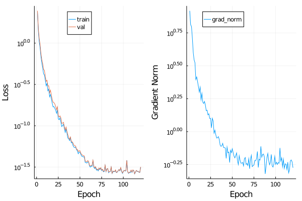

# Demo with single conditions

Key Configurations
```Julia
ns = 100;  # number of nodes / species
tfinal = 20.0;
ntotal = 40;  # number of samples for each perturbation

u0 = zeros(ns);
μ = rand(ns);

p_gold = gen_network(ns; weight_params=(0.0, 1.0), sparsity=0.9);

# pay attentions to this one, we can discuss if we need this one (encourage sparcity)
p_gold = sign.(p_gold) .* clamp.(abs.(p_gold), 0.1, Inf);
```

Put `\mu` outside of the function could reduce the number of variables to half and thus accelrate the ODE solver.

## Results

Loss and gradient norm



prediction


learned weights

```Julia
julia> show_network(p)
p_gold
5×6 Array{Float64,2}:
 0.66  0.0  0.85  0.0  0.0  0.0
 0.52  0.0  0.0   0.0  0.0  0.0
 0.26  0.0  0.0   0.0  0.0  0.0
 0.6   0.0  0.0   0.0  0.0  0.0
 0.29  0.0  0.0   0.0  0.0  0.0
p_learned
5×6 Array{Float64,2}:
 0.66  -0.01   0.86  -0.0  -0.0  -0.0
 0.51   0.0   -0.0   -0.0  -0.0  -0.0
 0.26   0.0    0.0   -0.0   0.0   0.0
 0.6    0.0   -0.0   -0.0  -0.0  -0.0
 0.29  -0.0    0.0    0.0   0.0   0.0
```
